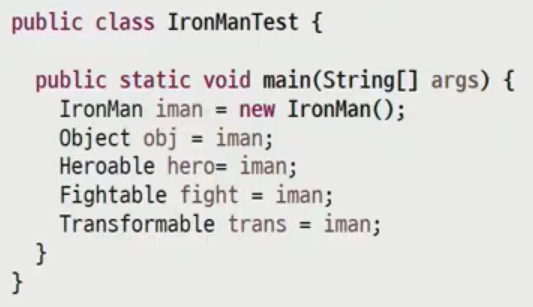

# 20220725

## 추상클래스

### 추상 클래스 정의

자손 클래스에서 반드시 재정의 사용되기 때문에 조상의 구현이 무의미한 메서드

- 메서드의 선언부만 남기고 구현부는 세미퀄른으로 대체
- 구현부가 없다는 의미로 abstract키워드를 메서드 선언부에 추가
- 객체를 생성할 수 없는 클래스라는 의미로 클래스 선언부에 abstract를 추가한다.

### 추상 클래스의 특징

- abstract 클래스는 상속 전용의 클래스
    - 클래스에 구현부가 없는 메서드가 있으므로 객체를 생성할 수 없음.
    - 하지만 상위 클래스 타입으로써  자식으로 참조할 수는 있다.
- 조상 클래스에서 상속 받은 abstract 메서드를 재정의 하지 않은 경우
    - 클래스 내부에 abstract메서드가 있는 상황이므로 자식 클래스는 abstract 클래스로 선언되어야한다.

### 추상 클래스를 사용하는 이유?

- abstract 클래스는 **구현의 강제를 통해 프로그램 안정성 향상**
- interface에 있는 메서드 중 구현할 수 있는 메서드를 구현해 개발의 편의 지원

## 인터페이스

## 인터페이스란?

- 서로 다른 두 시스템, 장치, 소프트웨어 따위를 서로 이어 주는 부분, 또는 그럼 접속 장치.
- GUI
    - 프로그램과 사용자 사이의 접점

## 인터페이스 작성

- 최고 수준의 추상화 단계: 일반 메서드는 모두 abstract형태
    - JDK 8에서 default method와 static method 추가
- 형태
    - 클래스와 유사하게 interface 선언
    - 멤버 구성
        - 모든 멤버변수는 public static final 이며 생략이 가능
        - 모든 메서드는 public abstract 이며 생략 가능

## 인터페이스 상속

- 클래스와 마찬가지로 인터페이스도 extends를 이용해 상속이 가능
- 클래스와 다른 점은 인터페이스는 다중 상속이 가능!!
    - 헷갈릴 메서드 구현자체가 없음.
    - 

## 인터페이스 구현과 객체 참조

- 클래스에서 implements 키워드를 사용해 interface 구현
- implements 한 클래스는
    - 모든 abstact 메서드를 override해서 구현하거나
    - 구현하지 않은 경우 abstact 클래스로 표시해야함.
- 여러 개의 interface implements 가능
- 다형성은 조상 클래스 뿐 아니라 조상 인터페이스에도 적용



## 인터페이스의 필요성

- 구현의 강제로 표준화 처리 → 손쉬운 모듈 교체 지원(live3-inter)
    - abstract 메서드 사용
- 인터페이스를 통한 간접적인 클래스 사용으로 손쉬운 모듈 교체 지원
- 서로 상속의 관계가 없는 클래스들에게 인터페이스를 통한 관계 부여로 다형성 확장 (live3-relation)
- 모듈 간 독립성 프로그래밍 가능 → 개발 기간 단축(live3-replace)

## default method

- 인터페이스에 선언 된 구현부가 있는 일반 메서드
    - 메서드선언부에 default modifier 추가 후 메서드 구현부 작성
    - 접근 제한자는 **public** 으로 한정됨(생략가능)
    
    ```jsx
    interface DefaultMethodInterface{
    	void abstractMethod();
    	default void defaultMethod(){
    		System.out.println("이것은 기본 메서드입니다.");
    	}
    }
    ```
    
- 필요성
    - 기존에 interface 기반으로 동작하는 라이브러리의 interface에 추가해야하는 기능이 발생
    - 기존 방식으로라면 모든 구현체들이 추가되는 메서드를 override 해야함.
    - default 메서드는 abstract가 아니므로 반드시 구현 해야 할 필요는 없어짐.

디폴드 메소드가 사용되면서 추상클래스의 사용이 줄어들었다.

- default method의 충돌
    - JDK 1.7이하의 java에서는 interface method에 구현부가 없으므로 충돌이 없었음.
    - 1.8 부터 default method가 생기면서 동일한 이름을 갖는 구현부가 있는 메서드가 충돌
    - method 우선 순위
        - super class의 method 우선: super class가 구체적인 메서드를 갖는 경우  default method는 무시한다.
        - interface간의 충돌 : 하나의 interface에서  default method를 제공하고 다른 interface에서도 같은 이름의 메서드가 있을때 sub class는 반드시 override해서 충돌을 해결해야한다.

## static method

- interface에 선언된 static method
    - 일반 static 메서드와 마찬가지로 별도로 객체가 필요없음.
    - 구현체 클래스 없이 바로 인터페이스 이름으로 메서드에 접근해서 사용가능
    
    
    

## Generics

- 다양한 타입의 객체를 다루는 메서드, 컬렉션 클래스에서 **컴파일 시 타입 체크**
    - 미리 사용할 타입을 명시해서 **형 변환을 하지 않아도 되게 함.**
        - 객체의 타입에 대한 안전성 향상 및 형 변환의 번거로움 감소

### 표현

- 클래스 또는 인터페이스 선언 시 <>에 타입 파라미터 표시
    - Class_name : raw Type
    - Class_name<T>: Generic Type
- 타입 파라미터
    - 특별한 의미의 알파벳 보다는 단순히 임의의 참조형 타입을 말함.
    - T : reference Type, E: Element, K: Key , V: Value
- 객체 생성
    - 변수 쪽과 생성쪽의 타입은 반드시 같아야함.

### type parameter의 제한

- 필요에 따라 구체적인 타입 제한 필요
    - 계산기 프로그램 구현 시 Number 이하의 타입으로만 제한
        - type parameter 선언 뒤 extends 와 함께 상위 타입 명시
    - 인터페이스로 제한할 경우도 extends 사용
    - 클래스와 함께 인터페이스 제약 조건을 이용할 경우 &로 연결

타입에 상관없이 다 담고 싶다면? Object를 넣는다.

Generic Type 객체를 할당 받을 때 와일드 카드(?) 이용

- generic type에서 구체적인 타입 대신 사용


- 파라미터와 리턴타입으로 type parameter를 갖는 메서드
    - 메서드 리턴 타입 앞에 타입 파라미터 변수 선언
    
    
    

### 짜투리 시간 String 이야기

StringBuffer s1 = new StringBuffer (”우리나라); // 동기화 코드 추가 ←멀티 스레드 사용 경우

StringBulider s1 = new StringBulider(”우리나라”);

s1.append(”대한민국 만세”);

str.replace(”a”,”o”);