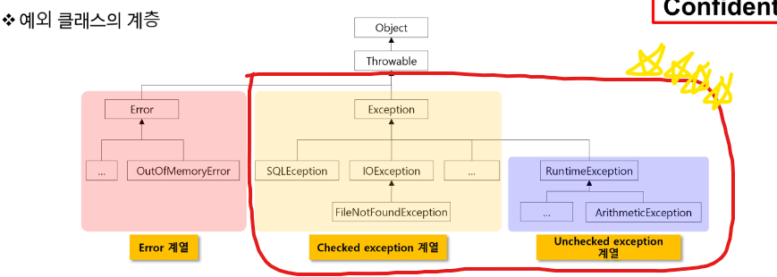

# 20220726

평가 관련 이야기

쉬움 문제이던 어려운 문제이던 점수는 똑같음. → 쉬운 문제 먼저 풀어라~

나중에 평가하는 것도 A 받기 위해서 쉬운것을 풀어라~

# Exception Handling & Collection Framework

## 에러와 예외

- 어떤 원인에 의해 오동작 하거나 비정상적으로 종료되는 경우
- 심각도에 따른 분류
    - Error
        - 메모리 부족, Stack overflow와 같은 일단 발생하면 복구할 수 없는 상황
        - 프로그램의 비 정상적 종료를 막을 수 없음 → 디버그
    - Exception
        - 읽으려는 파일이 없거나 네트워크 연결이 안되는 등 수습될 수 있는 비교적 상태가 약한 것들
        - 프로그램 코드에 의해 수습 될 수 있는 상황
- exception handling(예외 처리)란?
    - 예외 발생시 프로그램의 비 정상 종료를 막고 정상적인 실행 상태를 유지하는 것
        - 예외의 감지 및 예외 발생시 동작 코드 작성 필요

## 예외 클래스 계층



- **checked exception**
    - 예외에 대한 대처 코드가 없으면 컴파일이 진행되지 않음.
- **unchecked exception**
    - 예외에 대한 대처 코드가 없더라도 컴파일은 진행됨.

## try~catch 구문

```java
try{
	// 예외가 발생할 수 있는 코드
}
catch(XXException e){ //Exception 변수가 들어감. 던진 예외를 받음.
	// 예외가 발생핼을 때 처리할 코드
}
```

## Exception 객체의 정보 활용

- Throwable의 주요 메서드
    
    
    | 메서드 | 설명 |
    | --- | --- |
    | public String getMessage() | 발생된 예외에 대한 구제적인 메시지를 반환한다. |
    | public Throwable getCause() | 예외의 원인이 되는 Throwable 객체 또는 null을 반환한다. |
    | public void printStackTrace() | 예외가 밯생된 메서드가 호출되기까지의 메서드 호출 스택을 출력한다.
    디버깅의 수단으로 주로 사용된다. |


---

자주 보는 예외 종류

- NumberFormatException = 숫자 형식 예외 ⇒ 자주 보게 될거예염!
- ArrayIndexOutOfBoundsException = 배열 부족
- ArithmeticException = 0으로 나눌수없음.

---

## try-catch문에서의 흐름

- try 블록에서 예외가 발생하면
    - JVM이 해당 Exception 클래스의 객체 생성후 던짐(throw)
    - 던져진 exception을 처리할 수 있는 catch 블록에서 받은 후 처리
    - 정상적으로 처리되면 try-catch 블록을 벗어나 다음 문장 진행
- try블록에서 어떠한 예외도 발생하지 않은 경우
    - catch 문을 거치지 않고 try-catch 블록의 다음 흐름 문장을 실행

## 다중 exception handling

- try 블록에서 여러 종류의 예외가 발생할 경우
    - 하나의 try 블록에 여러 개의 catch 블록 추가 가능
- 다중 catch 문장 작성 순서 유의사항
    - JVM이 던진 예외는 catch문장을 찾을 때는 **다형성**이 적용
    - 상위 타입의 예외가 먼저 선언되는 경우 뒤에 등장하는 catch 블록은 동작할 기회가 없음.
    - 상속 관계가 없는 경우는 무관
    - **상속 관계에서는 자식에서 조상순으로 정의 해야함.!**

## 다중 예외 처리를 이용한 Checked Exception 처리

- 발생하는 예외들을 하나로 처리하기
    - 예외 상활 별 처리가 쉽지 않음
    - 가급적 예외 상활 별로 처리하는 것을 권장!
- 심각하지 않은 예외를 굳이 세분화 해서 처리하는 것도 낭비임.
    - ‘|’ 를 이용해 하나의 catch 구문에서 상속 관계가 없는 여러 개의 excetion 처리
- 계층을 이루는 예외의 처리
    - 상속 관계를 잘 고려해서 처리하자~

---

matches 이야기

```java
String.matches("[0-9]+"); //regular-expression
```

a ⇒ 1

a? ⇒ 0,1

a* ⇒ 0~무한

a+ ⇒ 1~무한 

- *X*?   → *X*, once or not at all
- *X →* *X*, zero or more times
- *X*+ → *X*, one or more times
- *X*{*n*} → *X*, exactly *n* times
- *X*{*n*,} → *X*, at least *n* times
- *X*{*n*,*m*} → *X*, at least *n* but not more than *m* times

---

런타임 에러의 경우 try_catch가 아닌 조건문을 통해 충분히 해결이 가능하다.

I/O 와 DataBase 의 공통점은 공유!

## try~catch~finally 구문을 이용한 예외 처리

- finally는 예외 발생 여부와 상관없이 언제나 실행
    - 중간에 return을 만나는 경우도 finally블록을 먼저 수행 후 리턴을 실행한다.
- 주요 목적: try 블록에서 사용한 리소스반납
- 생성한 시스템 자원을 반납하지 않으면 장래 resource leak 발생 → close처리
- finally에서 close를 통해 자원 반납
- 지저분할 수 밖에 없는 finally 블록
    - close 메서드 자체가 IOException 유발 가능
    - FileInputStream 생성자에서  IOException 발생시 fileInput은 null인 상황

try안에 있는 경우 실행안할수 있다는 가정하에 하기 때문에 초기값을 밖에 꼭 있어야한다.

→ 이것이 귀찮기 때문에 jdk 7 부터는 try에 괄호를 만들어서 집어넣을수 있게 되었음.

```java
try(FileReader fr = new FileReader("a.txt"){
// JDK7 버전 부터는 사용가능 -> 객체생성 된 IO 또는 DB 객체에 대한 close()를 자동으로 해준다.
// JavaProject에서만 경로를 표현할때 프로젝트명까지 생략가능
}
```

- try 선언문에 선언된 객체들에 대해 자동 close 호출(finally 역할)
    - 단 해당 객체들이 AutoCloseable interface 를 구현할 것
        - 각종 I/O stream, socket, connection…
    - 해당 객체는 try 블록에서 다시 할당될 수 없음.

---

문제!

- Try~finally 구문은 실행이 될까? → 실행된다.~
- Try 구문만 있다면 실행이 될까? → 안된다~

---

# throws 활용

## throws 키워드를 통해 처리 위임

- method에서 처리해야 할 하나이상의 예외를 호출한 곳으로 전달(처리 위임)
    - 예외가 없어지는 것이 아니라 단순히 전달됨.
    - 예외를 전달받은 메서드는 다시 예외 처리의 책임 발생
    - 처리하려는 예외의 조상 타입으로 throws 처리 가능
- checked exception 과 throws
    - checked exception은 반드시 try~catch 또는 throws 가 필요하다
    - 필요한 곳에서 try~catch 처리
- runtime exception 과 throws
    - runtime exception은 throws 하지 않아도 전달되지만 결국 try~catch로 처리해야함.

# 사용자 정의 예외

## 사용자 정의 예외

- api에 정의된 exception이외에 필요에 따라 사용자 정의 예외 클래스 작성

```java
class My extends Exception{
	My(String msg){
		super(msg);
	}
}

--> throw My("errorMsg");
```

- 대부분 exception 또는 runtimeException 클래스를 상속받아 작성
    - checked exception 활용 : 명시적 예외 처리 또는 throws 필요
        - 코드는 복잡해지지만 처리 누락 등 오류 발생 가능성은 줄어듦
    - runtime exception 활용 : 묵시적 예외 처리 가능
        - 코드는 간결해지지만 예외 처리 누락 가능성 발생
- 사용자 정의 예외를 만들어 처리하는 장점
    - 객체의 활용 - 필요한 추가정보, 기능 활용 가능
    - 코드의 재사용성 - 동일한 상활에서 예외 객체 재사용 가능
    - throws 메커니즘의 이용 - 중간 호출 단계에서 return 불필요
    

아래와 같이 사용자 예외 작성


# Collection Framework List 계열

## 자료구조

- 자료구조는 컴퓨터 과학에서 효율적인 접근 및 수정을 가능케 하는 자료의 조직, 관리, 저장을 의미한다. 더 정확히 말해, 자료 구조는 데이터 값의 모임, 또 데이터 간의 관계, 그리고 데이터 적용할 수 있는 함수나 명령을 의미한다.

## 배열

- 가장 기본적인 자료구조
- homogeneous collection:  동일한 데이터 타입만 관리 가능
    - 타입이 다른 객체를 관리하기 위해서는 매번 다른 배열 필요
- polymorphism
    - Object를 이용하면 모든 객체 참조 가능 → Collection Framework
    - 담을 때는 편리하지만 빼낼 때는 Object로만 가져올 수 있음.
    - 런타임에 실제 객체의 타입 확인 후 사용해야 하는 버거로움이 있다.
- Generic을 이용한 타입 한정
    - 컴파일 타입에 저장하려는 타입 제한 → 형변환의 번거로움 제거

```java
extends -> 확장하는데 사용한다고 생각하면 되고
implements -> 구현하는데 사용한다고 생각하면 됨.
다시 말해서 interface 에서는 extends를 사용한다.
```

## Collection Framework

- java.util 패키지
    - 다수의 데이터를 쉽게 처리하는 방법 제공 → DB 처럼 CRUD 기능 중요
- collection framework 핵심은 interface

| interface | 특징 |
| --- | --- |
| List | 순서가 있는 데이터의 집합. 순서가 있으니까 데이터의 중복을 허락 |
| Set | 순서를 유지하지 않는 데이터의 집합. 순서가 없어서 같은 데이터를 구별 할수 없음. → 중복허락하지 않음. |
| Map | key 와 value의 쌍으로 데이터를 관리하는 집합. 순서는 없고 key의 중복 불가, value는 중복 가능 |

## Collection interface

| 분류 | Collection |
| --- | --- |
| 추가 | add(E e)
addAll(Collection<? extends E> c) |
| 조회 | contains(Object o)
containsAll(Collection <?> c)
equals()
isEmpty()
iterator()
size() |
| 삭제 | clear()
removeAll(Collection<?> c)
retainAll(Collection<?> c) |
| 수정 |  |
| 기타 | toArray() |

## Collection Framework - List

### 특징

- 순서가 있는 데이터의 집합
- 순서가 있으므로 데이터의 중복을 허락
- 클래스는 결국 주소를 가지고 있다.
    - 근데 집어 넣을때 주소가 아닌 값을 넣어도 들어간다
        - 왜?→ 오토 박싱이 되기 때문에!(아래 참조)
- 관련 클래스 관계도


---

```java
int a;
     a= 100;
 Integer  b;

b = new Integer(200)

int c;
      c= new Integer(300);

Integer d;
              d = 400;
==> 가능할까요?

답변)
JDK5버전 ==> Wrapper클래스 지원, 오토박싱 지원

int a;
     a= 100;
 Integer  b;

b = new Integer(200)

=========================
 int a;
     a= new Integer(100);
 ==> 언박싱

Integer  b;
            b = 200;
 ==> 오토박싱
```

기본자료형       Wrapper클래스(기능 확장) : java.lang 패키지
byte               Byte
short              Short
int                 Integer
long               Long
float               Float
double            Double
char               Character
boolean          Boolean

---

### 주요 메서드

| 분류 | Collection | List |
| --- | --- | --- |
| 추가 | add(E e)
addAll(Collection<? extends E> c) | add(int index,E element)
addAll(int index,Collection <? extends E> c) |
| 조회 | contains(Object o)
containsAll(Collection <?> c)
equals()
isEmpty()
iterator()
size() | get(int index)
indexOf(Object o)
lastIndexOf(Object o)
listIterator() |
| 삭제 | clear()
removeAll(Collection<?> c)
retainAll(Collection<?> c) | remove(int index) |
| 수정 |  | set(int index,E element) |
| 기타 | toArray() | subList(int fromindex, int toIndex) |

### 배열과 ArrayList

- 배열의 장점
    - 가장 기본적인 형태의 자료 구조로 간단하며 사용이 쉬움
    - 접근 속도가 빠름
- 배열의 단점
    - **크기를 변경할수 없어** 추가 데이터를 위해 새로운 배열을 만들고 복사해야함.
    - 비 순차적 데이터의 추가, 삭제에 많은 시간이 걸림
    - 배열을 사용하는 ArrayList도 태생적으로 배열의 장-단점을 그대로 가져간다.
- LinkedList
    - 가 요소를 node로 정의하고 node 는 다음 요소의 참조 값과 데이터로 구성됨.
        - 각 요소가 다음 요소의 링크 정보를 가지며 연속적으로 구성 될 필요가 없다.
        
        
        
    - 데이터 삭제 및 추가
    
    
    

직접 해봅시다.

```java
import java.util.ArrayList;
import java.util.LinkedList;
import java.util.List;

public class ListTest {
	static void dataPrint(List<String> list) {
		for(String i :list) { // 개선된 for문
			System.out.println(i);
			
		}
	}
	public static void main(String[] args) {
		ArrayList<String> list1 = new ArrayList<>();
		list1.add("용장");
		list1.add("준장");
		list1.add("과장");
		list1.add("막장");
		dataPrint(list1);
		
		LinkedList<String> list2 = new LinkedList<>();
		list2.add("봄");
		list2.add("여름");
		list2.add("가을");
		list2.add("겨울");
		
		dataPrint(list2);
	}

}
/*
출력 결과
용장
준장
과장
막장
봄
여름
가을
겨울
*/
```