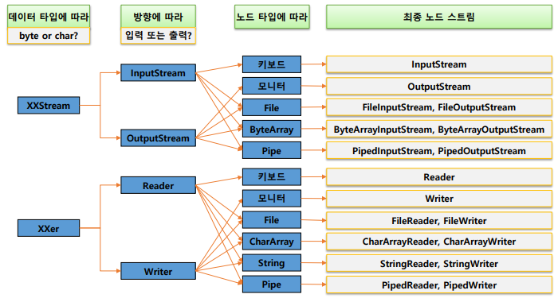

# 20220728

오늘은 IO와 XML을 배울 예정.

# IO

## 노드스트림

### I/O와 Stream

- I/O 데이터의 입력(input)과 출력(output)
- 데이터는 한쪽에서 주고 한쪽에서 받는 구조로 되어있음.
    - 이때 입력과 출력의 끝단: 노드(node)
    - 두 노드를 연결하고 데이터를 전송할 수 있는 개념: 스트림(Stream)
        - 물의 흐름이나 전기의 흐름과 같은 개념
    - 스트림은 단방향으로만 통신이 가능하며 하나의 스트림으로 입력과 출력을 같이 처리할 수 없음.

### Node Stream의 종류와 naming

- Node stream : node에 연결되는 스트림



### InputStream의 주요 메서드

- read()
- close()
- 바이트 한 개씩 읽음


- Buffer 만큼 씩 읽음


### Reader의 주요 메서드

- read()
- close()
- Buffer 만큼 씩 읽음


### outputSteam

- write() → 출력
- close() → 종료
- flush() → 버퍼 비우기

### Wirter

- write() → 출력
- append → charSequence csq를 출력하고 Writer를 리턴한다.
- close → 종료
- flush() → 버퍼 비우기

### File

- 가장 기본적인 입출력 장치 중 하나로 파일과 디렉터리를 다루는 클래스

### FileInputStream, FileOutputStream

- FileInputStream() → name 경로의 파일을 읽는 FileinputStream을 생성한다.
- FileOutputStream → name 경로의 파일에 출력하는 FileOutputStream을 생성한다.

### FileReader,FileWriter

## 보조 스트림

노드스트림은 기본으로 알고잇어야하고 노드스트림만 사용하지는 않음.

보조 스트림을 많이 사용함.

- 다른 스트림에 부가적인 기능을 제공하는 스트림
- 스트림 체이닝(stream chaining)
    - 필요에 따라 여러 보조 스트림을 연결해서 사용 가능

### 보조 스트임의 종류

- byte 스트림을 char 스트림으로 변환 : InputStreamReader , outputStreamWriter
- 버퍼링을 통한 속도 향상 : BufferedInputStream, BuffererdOutputStream
- 객체 전송 : ObjectinputStream, ObjectOutputStream

- 생성- 이전 스트임을 생성자의 파라미터에 연결
- 종료 - 보조 스트림의 close()를 호출하면 노드 스트림의 close까지 호출됨.

### 사용할 스트림의 결정 과정

- 노드가 무엇인가 → 타입은 문자열인가? 바이트인가? → 방향이 무것인가? → 추가 기능이 필요한가?

## 보조 스트림 활용

### InputStreamReader &OutputStreamWriter

- byte기반 스트림을 char기반으로 변경해주는 스트림
    - 문자열을 관리하기 위해서 바이트 단위보다 char 단위가 유리
    - 키보드에서 입력을 받은 데이터를 처리할 경우
- 변환시 encoding 지정 가능

### Buffered계열

- 버퍼의 역할 : 버퍼라는 공간안에 미리 넣어놓고 차례차례 전송하는 역할
- BufferedReader & BufferedWriter
- BufferedReader:readLine() → 줄 단위로 데이터를 읽어 들임

### 객체 직렬화(serialization)

- 객체를 파일등에 저장하거나 네트워크로 전송하기 위해 연속적인 데이터로 변환하는 것
- 반대의 경우는 역 직렬화(deserialization) 라고 한다.
- 직렬화가 되기 위해 조건
    - serializable 인터페이스를 구현할것
    - 클래스의 모든 멤버가 serializable 인터페이스를 구현함
    - 직렬화에서 제외하려는 멤버는 transient 선언
        - 모든 멤버 변수도 serializable 인터페이스가 되어있어야한다.
- serialVersionUID
    - 클래스의 변경 여부를 파악하기 위해 유일 키
    - 직렬화 할때의 UID와 역직렬화 할때의 UID가 다를 경우 예외 발생
    - 직렬화되는 객체에 UID가 설정되지 않았을 경우 컴파일러가 자동 생성
        - 멤버 변경으로 인한 컴파일 시마다 변경 → InvalidClassException 초래
    - 직렬화되는 객체에 대해서 serialVersionUID 설정 권장

어떻게 serialization를 사용해 볼까?

### ObjectInputStream, ObjectOutputStream

- ObjectOutputStream() : 객체를 생성
    - writeObject() : obj를 직렬화 해서 출력한다.
- ObjectInputStream() : 객체 생성.
    - readObject() : 직렬화된 데이터를 역직렬화해서 오브젝트로 리턴한다.
- 

작년 기준

아파트 정보들 (매매, 전세 등) 을 이용하여 전체적으로 공부한내용을 이용하여 개발하는 것.

## 공공데이터와 XML

공공데이터란?

- 공공기관이 만들어내는 모든 공적인 정보
- 각 공공기관이 보유한 데이터를 개방하여 누구나 원하는 기능에 활용가능
- [www.data.go.kr](http://www.data.go.kr) 등 회원가입 후 개별 키를 발급 받아 사용가능

### 데이터의 형태

- CSV
    - comma separated value
    - 용량이 작지만 구조적이지 못함
- XML
    - 태그를 통해 데이터 형식 정의
    - 구조적, 정확한 문법이 필요, 큰 용량
- JSON
    - Json(javaScript Object Notation)을 통해 데이터 형식 정의
    - 구조를 가지며 객체로 다른 언어와 호환

### XML

- markup Language
    - 태그 등을 이용하여 문서나 데이터의 구조를 명기하는 언어
    - HTML, SGML,…
- XML
    - Extensible Markup Language
- HTML과 달리
    - 필요에 따라서 태그를 확장해서 사용가능
    - 정확한 문법을 지켜야 동작 : Well formed
- 기본 문법
    - 문저의 시작은<?xml version="1.0" encoding="UTF-8"?> 로 한다.
    - 반드시 root element가 존재해야 한다.
        - 나머지 태그들은 Tree 형태로 구성된다.
    - 시작 태그와 종료 태그는 일치해야 한다.
    - 시작 태그는 key-value 구조의 속성을 가질 수 있다.
        - 속성 값은 “” 또는 ‘’로 묶어서 표현한다.
    - 태그는 대소문자를 구별한다.
- 간단한 xml 문서 만들기

```xml
<?xml	version
="1.0"	encoding="UTF-8"?>
<ssafy>
	<student	no="12345">
		<name>홍길동</name>
		<loc>광주</loc>
		<phone>010-222-3333</phone>
	</student>

	<student	no="23456">
		<name>장길산</name>
		<loc>서울</loc>
		<phone>010-333-4444</phone>
	</student><student	no="34567">
		<name>임꺽정</name>
		<loc>대전</loc>
		<phone>010-111-2222</phone>
	</student>
</ssafy>
```

- valid(밸리드)
    - xml 태그는 자유롭게 생성하기 때문에 최초 작성자의 의도대로 작성되는지 확인할 필요가 있다.
        - 문서의 구조와 적절한 요소, 속성들의 개수, 순서들이 잘 지켜졌는가?
        - DTD 또는 Schema를 이용해서 문서의 규직 작성
            - DTD, Schema는 나중에 알려주신다고함.
        - DTD,Schema를 잘 따른 문서를 valid하다 라고 한다.
    
    문서의 규칙들
    
    - student는 여러명 있다.
    - 각 student들은 name, loc ,phone을 하위 태그로 갖는다.
    - student는 no를 속성으로 갖는다.
    - name, loc , phone은 문자열을 값으로 갖는다.
    - no는 문자열을 값으로 갖는다.  생략 시 0

## 문서의 Parsing - SAX

### 파싱

- 문서에서 필요한 정보를 얻기 위해 태그를 구별하고 내용을 추출하는 과정
    - 전문적인 parser 활용
- SAX parser
    - Simple API for XML parser
    - **문서를 읽으면서 태그의 시작,종료 등 이벤트 기반으로 처리하는 방식**
- DOM parser
    - Document Object Mode
    - **문서를 다 읽고 난 후 문서 구조 전체를 자료구조에 저장하여 탐색하는 방식**
- SAX는 빠르고 한번에 처리하기 때문에 다양한 탐색이 어렵다
- DOM은 다양한 탐색이 가능하지만 느리고 무거우며 큰 문서를 처리하기 어렵다

### SAX parser 동작 방식

- 문서를 읽다가 발생하는 이벤트 기반으로 문서처리


---

SimpleDateFormat 이걸로 date 포맷을 변경가능함

DefaultHandler 상속 받는다.

---

## 문서의 Parsing - DOM

### 동작 방식

- **문서를 완전히 메모리에 로딩 후 필요한 내용 찾기**
- DOM Tree
    - 문서를 구성하는 모든 요소를  Node(태그, 속성, 값)로 구성
    - 태그들은 root 노드(주소록)을 시작으로 부모-자식의 관계 구성

```xml
-Node
public static final short ELEMENT_NODE =	1;
public static final short ATTRIBUTE_NODE =	2;
public static final short TEXT_NODE =	3;
.	.	.
public String	getNodeName();
public String	getNodeValue()	throws DOMException;
public short getNodeType();
public Node	getParentNode();
public NodeList getChildNodes();
public Node	getPreviousSibling();
public Node	getNextSibling();
public String	getTextContent() throws DOMException;

-Elementextends Node
public NodeList getElementsByTagName(String	name);
public String	getAttribute(String	name);
public String	getTagName();
```

## 문서의 Parsing - JSON

### Json

- Javascript ObjectNotation(자바스크립트에서의 객체 표현법 )
- 간결한 문법,단순한 텍스트,적은 용량으로 대부분의 언어,대부분의 플랫폼에서 사용 가능
    - 이 기종 간의 데이터 교환에 광범위하게 사용됨
- 객체를 key- value의 쌍으로 관리
- 

# Swing

## Swing

- Java Application에서 사용되는 GUI를 제공하는 추상적으로 정의된 도구 모음
- Container
    - 다른 컴포넌트들을 배치하기 위한 컴포넌트
    - Container는 다른 Container를 포함할 수 있고 나중에 복합적인 Layout을 구성할 수 있게 한다.
    - JFrame:독립적으로 사용될 수 있으며 타이틀과 사이즈를 조절할 수 있는 버튼을 가짐
    - JPanel:반드시 다른 Container에 포함되어야 하며 복합적인 레이아웃 구성에 사용
- 다른 Component
    
    ```java
    JButton b;	
    JLabel l;	
    JTextField tf;
    JTable table;
    JList list;
    ```
    

### Layout과 LayoutManager

- Layout: Component들을 Container에 어떻게 배치할 것인가
- LayoutManager:Container별로 Component의 위치와 크기,배치 방식을 결정하는 객체
- FlowLayout
    - JPanel의 기본 LayoutManager
    - 요소를 가로로 물 흐르듯이 배치
- BorderLayout
    - JFrame의 기본 LayoutManager
    - 특별한 영역 즉,North,South,West,East,Center에 각각의 컴포넌트를 배치한다.
        - Component들을 배치할 때는 영역을 지정(BorderLayout.CENTER or“Center”)
        - 사용하지 않는 공간은 크기가 0*0이 되고 Center가 기본이다
        - 각각의 영역에는 하나의 Component를 담을 수 있고 중복해서 담을 경우는 마지막에 담은 컴포넌트만 보인다.
        - 크기를 조절할 때 North와 South는 좌우로,East와 West는 상하로만 늘어난다. Center는 양방향
- Layout설정
    - 생성자 또는 setLayout 메서드로 layout변경 가능
    
    ```java
    JPanel panel =	new JPanel();	//	FlowLayout
    panel.setLayout(new BorderLayout());	//	BorderLayout
    
    JPanel panel2 =	new JPanel(new GridLayout());	//	GridLayout
    ```
    
- 복합적인 Layout구성
    - Container안에 또다른 Container를 배치하는 형태로 복합적인 Layout구성

## 이벤트 처리 모델(DelegationModel)