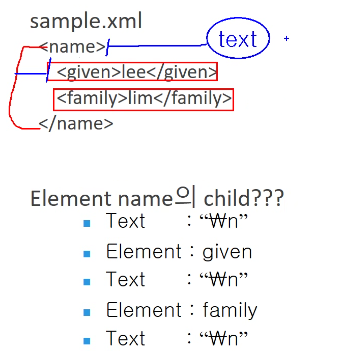

# 20220729

XML 정리

- XML란?
    - 표준 데이터, text 데이터
        - 운영체제, 프로그램,DB 종류 가리지 않고 사용
        - 데이터 저장하는 형식
- 데이터는 어떻게 정의 할까?
    - 시작태그와 끝태스 사이에 정의
    - 시작태그 또는 끝태그의 속성값으로 정의

```xml
용어정리
<table> 시작태그 (StartTag)
</table> 끝태그   (EndTag)
<br/>     빈태그   (EmptyTag)
```

예시) 아래의 XML에어 table의 엘리먼트는?

```xml
<table>
   <tr>
       <td>hello</td>
   </tr>
</table>
```

답: 안에 있는 내용까지 포함:(엘리먼트)

```xml
   <tr>
       <td>hello</td>
   </tr>
```

- XML의 특징
    1. 최소 한개 이상의 element를 가져야함.
    2. 문서 전체를 감싸는 한개의 엘리먼트가 있어야함.
    3. 시작태그가 있다면 그것에 매핑되는 끝태그가 반드시 존재해야한다.
    4. XML은 대소문자를 구분
    5. 엘리먼트는 포함관계가 꼬이면 안됨.
    6. xml선언은 전체 생략가능하나 선언하는 것을 권장
        
        ```xml
        <?xml version='1.0' encoding='UTF-8'   ?>
             ===> version은 생략 불가
             ===> version속성을 먼저, encoding속성은 나중에 기술.  
             ===> 속성값은 ''(작은따옴표) 또는 ""(큰 따옴표) 사용.
             ===> '<?xml' 앞에 공백(whitespace)을 쓰면 절대 안됨!!!
        ```
        
    7. 태그의 내용에 제한된 문자가 있다.
        - &, <, ]]> 사용하면 에러
        - 그럼 어떻게 해야할까요~?
            - 제한된 문자를 replace() 메소드로 변환
                - replace(’<’,’&lt;’)
            - CDATA섹선을 사용
                - <!CDATA[”여기에 내용 작성하기”]]>
                    - 파싱 할때 내용만 가져와짐!
    
     7-2. 속성값에 제한된 문자
    
    - '&' , '<’
    1. 속성값은 반드시 인용부호(작은 따옴표, 큰 따옴표)를 반드시 사용.
    2. 서로 다른 속성은 반드시 공백을 통해 구분
    3. 주석문(설명문,comment)에 제한된 문자
        - -- 제한
    4. XML spec에 맞게 작성된 문서를 → Well-Formed XML 문서
        - 추가적인 제한 사항, 형식(DTD, XMLSchema)을 만족 → Validate 문서
    5. DTD(Document Type Definition)
        - XML 문서내에 출현할 태그와 속성에 대해 정의
            - (태그종류, 태그순서, 태그 포함관계, 태그내의 속성)
        - 엘리먼트 태그 선언
            - <!ELEMENT 태그명 (태그내의 내용)>
            - ex1> <!ELEMENT tag (#PCDATA)> → <tag>텍스트데이터</tag>
            - ex2> <!ELEMENT tag (a,b,c)>→ ','는 자식 태그간의 순서(sequence)를 표현
            - ex3> <!ELEMENT tag (a|b|c)+> → '|'는 선택(choice)을 표현, 보통 순서없는 관계를 표현할 때 사용
            - ex4><!ELEMENT tag EMPTY>
            - ex5><!ELEMENT tag ANY>
        - 속성선언
            - <!ATTLIST 태그명 속성명 속성자료형 기본선언>
            
            ```xml
            <!ATTLIST tag a         CDATA       #REQUIRED           
                          b         ID          #IMPLIED
                          c         (남성|여성)   "여성"
                          location  CDATA       #FIXED "서울">
            <!-- 서울이 기본으로 들어가게 되어있음/-->
            
            ===>  <tag a="100"
                       b="x100"
                       c="남성"
                       location="서울"/>
            ```
            

---

갑자기 시험나오는 이야기 

- dom , sax 관련해서 나올수있음.
- 4지선다 위주로 나옴
- 주관식도 나올수있음.
    - 100글자 이상이라고 적혀있으면 무조건 100글자 이상적어야함.
- 자바의 최상위는? Object 기억해랏!
- catch 없는 finally 써도 된다.

---

- 주석도 요소임!

### XML의 특징

Node

- XML 문서를 구성하는 모든 요소를 상징하는 객체이다.
- 모든 객체의 공통적인 특성을 모아 놓은 추상화된 객체라 할수 있다.

Document

- XML 문서의 Root Element의 바로 위에 위치하며, 문서 전체의 Root객체 역할을 한다.
- 일종의 가상 객체라고 할 수 있다.

Element

- XML문서에서 가장 중요하고 기본이 되는 단위.
- 속성과 관련된 기능들을 가지고 있음.
- 상속관계
    - node
        - Document
        - Element

### Node

Node자체의 **정보를 얻거**나 정하는 메서드

Node를 **조작**하는 메서드 (CRUD)

**Related** Node를 얻는 메서드 - 관계 관련된 것들

mothod 분류는 직접해보세용~




nodeList

- 리스트를 담는 바구니라고 생각하면 됨.
- attribute는 담지 못함.

NamedNodeMap

- attribute는 여기서 이용가능함.!

Dom parser 생성하기

3가지 생성방법 비교

- **DocumentBuilder**를 이용해 Document를 생성해 사용한다.
- DOMParser 클래스를 직접 생성해 parsing

---

갑자기 시험관련

메모리를 읽어서 파일에 저장하고 싶으면 FileOutputStream

- 출력객체에서는 파일이 없으면 생성하는 기능이 있음.

FileinputStream 도 파일이 없는데 불러오려고 하면 어떻게 될까요~?

- 에러가 남! 만들지 않기 때문에

write 는 b는 바이트! 숫자를 넣어도 문자로 출력됨!

---

이번 관통 프로젝트로는 **조작** 보다는 **조회**쪽이 많이 나옴.

### SAX(the simple api for xml)

xml - dev mailing list  회원들의 제안

parser의 상호간에 표준 api 필요성 제기

DOM의 장점은 SAX의 단점

SAX의 장점은 DOM의 단점

키워드에서 이벤트를 확인하는 방식?

이벤트에 발생하는 함수 : 콜백함수


### 순서 

handler

중요한 메서드 들

- public void startDocument() : Document가 시작된다는 이벤트가 발생할 때 호출
- public void endDocument() : XML 문서의 파싱이 끝날 때 발생하는 이벤트에 호출
- public void startElement() : 엘리먼트가 시작된다는 이벤트가 발생할 때 호출
- public void endElement() : 엘리먼트가 끝났다는 이벤트가 발생할 때 호출
- public void characters() : 파싱이 character를 만났을때 발생하는이벤트에 호출